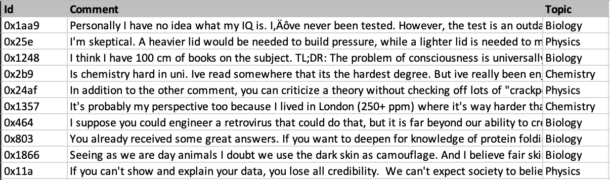
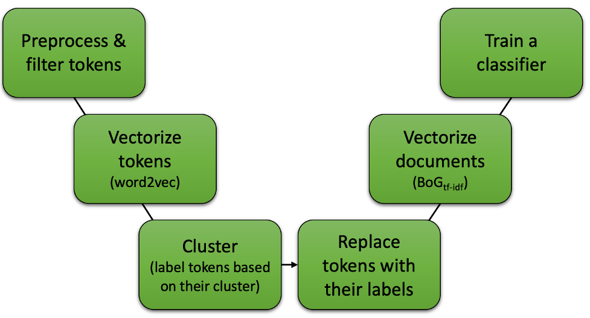
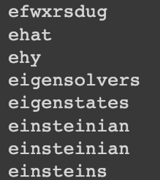
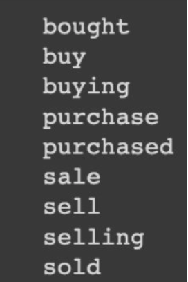
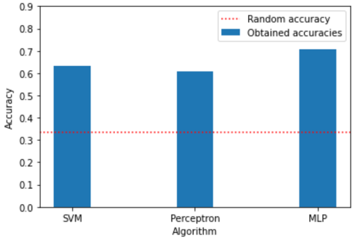

# Computational Intelligence course Projects

This repository contains the projects done in the context of the "Introduction of Computational Intelligence" course held at the Ferdowsi University of Mashhad(FUM). During the semester, we were assigned three projects as follows:

1. [Clustering](#proj1-clustering)
2. [Perceptron + Kernel trick](#proj2-perceptron--kernel-trick)
3. [Word2Vec + BoG](#word2vec--bog)

## Proj1: Clustering
We were supposed to work with [ORL dataset](!https://www.kaggle.com/datasets/tavarez/the-orl-database-for-training-and-testing). We should easily flatten the images and then fit the clustering algorithms with them. We were asked to work with `DBSCAN`, `K-means`, and `Agglomerative` algorithms. I experimented with three different data normalizations before feeding them to the algorithms, as follows:

* **None:** no normalization has been applied to the data
* **StandardScaler:** normalize data to have *mean* of 0 and *std* of 1
* **Range [0,1]:** normalize data pixels to have value in range of [0,1]. 

*It is worth noting that, due to using a very basic representation of our data (flattening pixels), this last method didn't make any significant change in comparison to applying no normalization!*

Furthermore, to evaluate the performance of the algorithms we had to implement the `Rand Index` metric.

Additionally, we had to choose one of the above algorithms and propose a solution to relatively enhance its performance. I chose DBSCAN. To have a promising clustering using DBSCAN we have to carefully choose two hyperparameters: *MinPts* and *epsilon*. 

During my experience of finding optimal parameters for this assignment, I faced many challenges to find the right *epsilon* and also figured out its high importance (especially in comparison with *MinPts*). Choosing the optimal *epsilon* has a direct relationship with the outcome. However, finding the optimal *epsilon* can be overwhelming and tricky. To remedy this, I came up with an automated approach that is able to find the optimal *epsilon* for cases we access the ground truth of our data. The process of finding *epsilon* is as follows:

1. Compute distance (in this case euclidean distance) between each pair of different classes. Now we have a list of distances per each class (say class A) indicating the distances of samples of class A to all other samples from other classes

2. Compute the average distances per class. Now we have a scalar for each class. E.g., the number associated with class A indicates the average distance between class A and other classes' samples

3. Finally, *epsilon* is computed as the mean of all obtained averages from the previous step. In the end, the value of *epsilon* is divided by a constant number (=2)

*!!! Please note that you can also find brief documentation (written in Persian) for this assignment, in the corresponding directory of this project!*

## Proj2: Perceptron + Kernel trick
*Yes, the title may seem a little weird at first, but stay tuned!!!*

In this project, we were supposed to predict the amount of passengers' **satisfaction** with the airline. We were given [this dataset](!https://www.kaggle.com/datasets/teejmahal20/airline-passenger-satisfaction?select=train.csv) including test and train `CSV` formatted files. Each file contains various information such as the passenger's age or travel class and the target was to predict the value of the last column, **satisfaction**.

We were asked to firstly apply the `Perceptron` and `SVM` algorithms on the data and inspect the results. 

However, since `Perceptron` doesn't work well with non-linear separable data, we had to propose a solution for it... So we used `Perceptron` with ***kernel trick***! Taken from [here](!https://datamites.com/blog/support-vector-machine-algorithm-svm-understanding-kernel-trick/#:~:text=A%20Kernel%20Trick%20is%20a,Lagrangian%20formula%20using%20Lagrangian%20multipliers.%20), Kernel Trick is:
> A simple method where a Non Linear data is projected onto a higher dimension space so as to make it easier to classify the data where it could be linearly divided by a plane

The following figure, which is taken from [here](!https://www.researchgate.net/publication/340618118_Multi-stage_Jamming_Attacks_Detection_using_Deep_Learning_Combined_with_Kernelized_Support_Vector_Machine_in_5G_Cloud_Radio_Access_Networks), intuitively shows this trick well!

As a suggestion to the inability of the `Perceptron` algorithm 
to classify the *nonlinearly separable* data, I replaced the basic multiplication (`weights*features`) with the kernel trick. I used four following kernels:

* Linear
* Polynomial
* Gaussian
* RBF

As can be seen in the above figure, by replacing the conventional multiplication with the kernel multiplication, the performance of the `Perceptron` algorithm could be improved! I also believe that by spending more time on tuning the parameters of kernels such as `sigma` and `coef`, the results will be even more encouraging!

## Word2Vec + BoG
This project was jointly done by me and my teammate, Zahra Kiani. In this project, we were asked to solve the problem of the Bag of Words (`BoG`) method, which considered similar words separately, with the help of the `Word2Vec` method. We had to train and test our solution with this dataset, containing users' comments on **Reddit** as well as the corresponding category of the comments (target).

The following figure illustrates the summary of the presented method:

### Preprocess & filter tokens
Since the data had been collected on the Internet containing users' comments on Reddit, the data was not initially ideal to work with. Hence, we cleaned and preprocessed the data as follows:

* Replace newline character (`'\n'`) with space character (`' '`)
* Tokenize text based on *alphabet characters* and *digits* (`[a-zA-Z]+|[0-9]+`)
    * Results in eliminating existing *emojis* and *special characters*
* Eliminate all existing *numbers* and *digits*
* Eliminate *Stop words*
* Lemmatize tokens

After applying the above process, the number of unique tokens reduced from *34,079* to *15,107*!!!

### Vectorize tokens (`Word2Vec`)
We used a pre-trained vector called `word2vec-google-news-300`. It is trained on a part of the Google News dataset (~100B words) which contains 300-dimensional vectors for 3M words. 

By having the tokens and this model, we should easily get the vector representation of the words to work with, in the next steps. However, there were several cases where the tokens contained **typos** or be a **part of URLs** that results in not being available among the provided words by `word2vec-google-news-300`. Hence, to solve the issue of the existence of typos, we used the `SpellChecker` library. The following image pictures some instances of typos or being part of URLs.

## Cluster
To remedy the issue of considering words with the same meaning independent of each other, we kind of needed to present all of the words with the same meaning with a single label/representation.

As one section of our project, we were asked to implement the clustering approach proposed in *Data Clustering Based On Key Identification* ([paper](!http://jsdp.rcisp.ac.ir/article-1-529-en.html)). The main portion of the paper's implementation was done by Zahra Kiani. However, since our implementation was ***sequential*** it took a long time to run with big data, like ours. Hence, we replaced it with the `Agglomerative` clustering approach.

After applying the clustering, a total 15,107 number of words were assigned to 5147 clusters, i.e., on average, each cluster contained 2.7 tokens.

## Replace tokens with labels
Since every token was assigned to a single cluster, we only needed to walk through the data and replace every taken with its corresponding cluster label. 

The above image is a proper example that pictures the data points existing in a cluster. Previously, while computing `TF-IDF`, the frequency of each word was considered separately. Now, all of them are replaced with a single ID resulting in computing the frequency altogether.

## Vectorize documents
Now, by equally considering the words that were semantically close to each other, the `BoG` algorithm could be implemented. It should be noted that at this stage, we only kept tokens that have appeared in at least 2 documents (otherwise, that token did not be considered in creating vectors).

By doing the above-mentioned process, the vector for each document had 4730 dimensions which resulted in our total dataset being of shape `(8695, 4730)`.

## Train a classifier
At this stage, having vector documents (features) and their topic (ground truth), we could effortlessly train a classifier in a supervised manner. For this purpose, we used `SVM`, `Perceptron`, and `MLP` algorithms that the obtained accuracies are *63.14%*, *60.66%*, and ***70.80%***, respectively.

*!!! Please note that you can also find brief documentation (written in Persian) for this assignment, in the corresponding directory of this project!*