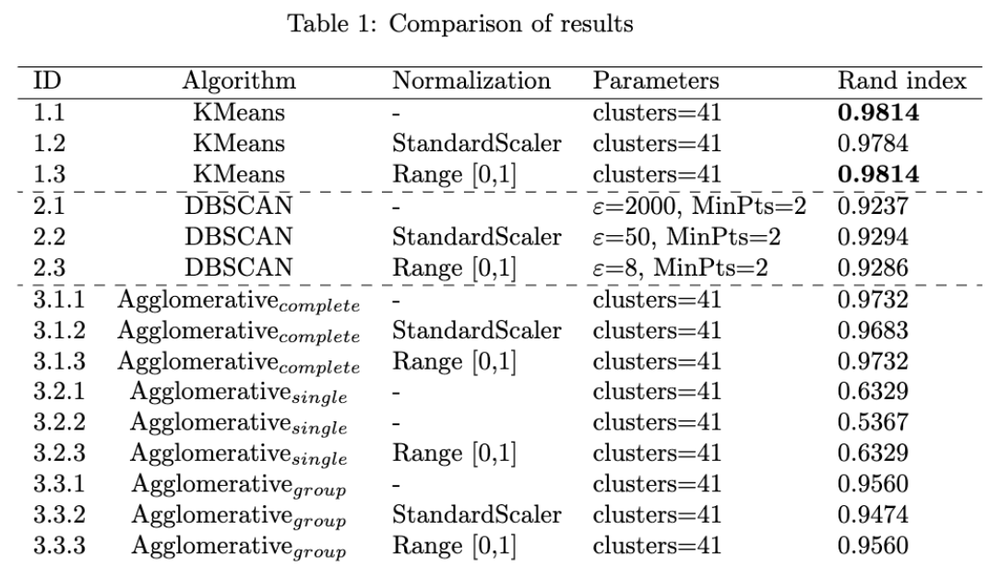
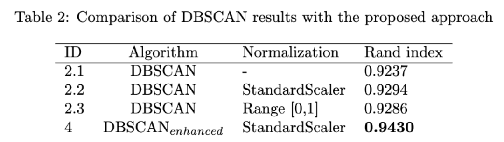
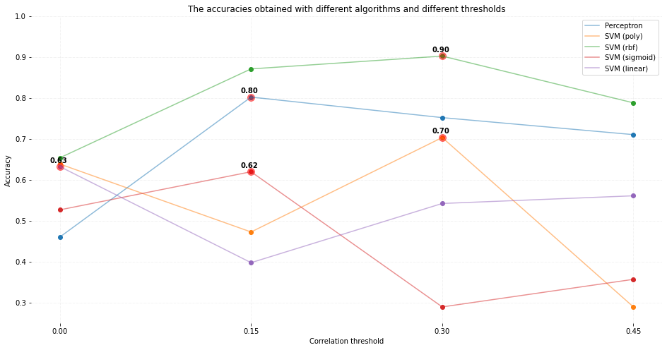
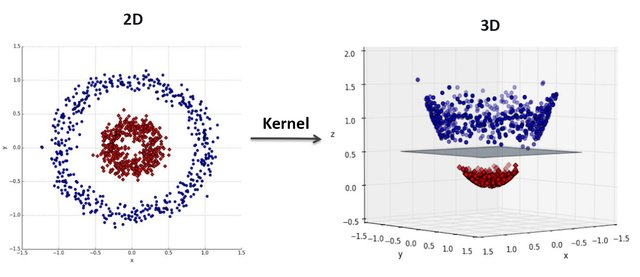
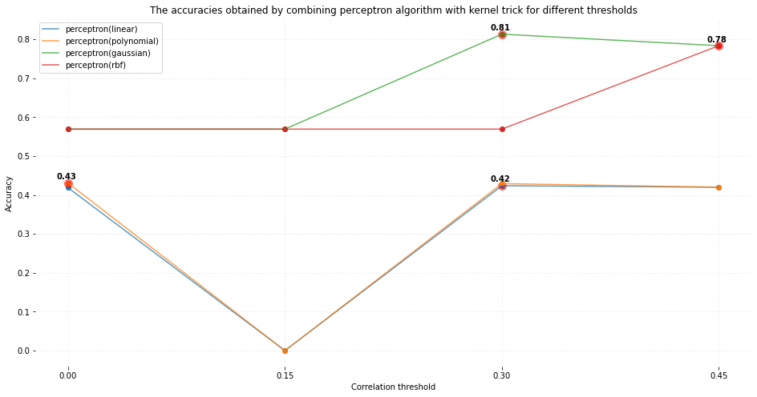

# Computational Intelligence course Projects

This repository contains the projects done in the context of the "Introduction of Computational Intelligence" course held at the Ferdowsi University of Mashhad(FUM). During the semester, we were assigned three projects as follows:

1. [Clustering](#proj1-clustering)
2. [Perceptron + Kernel trick](#proj2-perceptron--kernel-trick)

## Proj1: Clustering
We were supposed to work with [ORL dataset](!https://www.kaggle.com/datasets/tavarez/the-orl-database-for-training-and-testing). We should easily flatten the images and then fit the clustering algorithms with them. We were asked to work with `DBSCAN`, `K-means`, and `Agglomerative` algorithms. I experimented with three different data normalizations before feeding them to the algorithms, as follows:

* **None:** no normalization has been applied to the data
* **StandardScaler:** normalize data to have *mean* of 0 and *std* of 1
* **Range [0,1]:** normalize data pixels to have value in range of [0,1]. 

*It is worth noting that, due to using a very basic representation of our data (flattening pixels), this last method didn't make any significant change in comparison to applying no normalization!*

Furthermore, to evaluate the performance of the algorithms we had to implement the `Rand Index` metric.

Additionally, we had to choose one of the above algorithms and propose a solution to relatively enhance its performance. I chose DBSCAN. To have a promising clustering using DBSCAN we have to carefully choose two hyperparameters: *MinPts* and *epsilon*. 

During my experience of finding optimal parameters for this assignment, I faced many challenges to find the right *epsilon* and also figured out its high importance (especially in comparison with *MinPts*). Choosing the optimal *epsilon* has a direct relationship with the outcome. However, finding the optimal *epsilon* can be overwhelming and tricky. To remedy this, I came up with an automated approach that is able to find the optimal *epsilon* for cases we access the ground truth of our data. The process of finding *epsilon* is as follows:

1. Compute distance (in this case euclidean distance) between each pair of different classes. Now we have a list of distances per each class (say class A) indicating the distances of samples of class A to all other samples from other classes

2. Compute the average distances per class. Now we have a scalar for each class. E.g., the number associated with class A indicates the average distance between class A and other classes' samples

3. Finally, *epsilon* is computed as the mean of all obtained averages from the previous step. In the end, the value of *epsilon* is divided by a constant number (=2)

*!!! Please note that you can also find brief documentation (written in Persian) for this assignment, in the corresponding directory of this project!*

## Proj2: Perceptron + Kernel trick
*Yes, the title may seem a little weird at first, but stay tuned!!!*

In this project, we were supposed to predict the amount of passengers' **satisfaction** with the airline. We were given [this dataset](!https://www.kaggle.com/datasets/teejmahal20/airline-passenger-satisfaction?select=train.csv) including test and train `CSV` formatted files. Each file contains various information such as the passenger's age or travel class and the target was to predict the value of the last column, **satisfaction**.

We were asked to firstly apply the `Perceptron` and `SVM` algorithms on the data and inspect the results. 

However, since `Perceptron` doesn't work well with non-linear separable data, we had to propose a solution for it... So we used `Perceptron` with ***kernel trick***! Taken from [here](!https://datamites.com/blog/support-vector-machine-algorithm-svm-understanding-kernel-trick/#:~:text=A%20Kernel%20Trick%20is%20a,Lagrangian%20formula%20using%20Lagrangian%20multipliers.%20), Kernel Trick is:
> A simple method where a Non Linear data is projected onto a higher dimension space so as to make it easier to classify the data where it could be linearly divided by a plane

The following figure, which is taken from [here](!https://www.researchgate.net/publication/340618118_Multi-stage_Jamming_Attacks_Detection_using_Deep_Learning_Combined_with_Kernelized_Support_Vector_Machine_in_5G_Cloud_Radio_Access_Networks), intuitively shows this trick well!

As a suggestion to the inability of the `Perceptron` algorithm 
to classify the *nonlinearly separable* data, I replaced the basic multiplication (`weights*features`) with the kernel trick. I used four following kernels:

* Linear
* Polynomial
* Gaussian
* RBF

As can be seen in the above figure, by replacing the conventional multiplication with the kernel multiplication, the performance of the `Perceptron` algorithm could be improved! I also believe that by spending more time on tuning the parameters of kernels such as `sigma` and `coef`, the results will be even more encouraging!